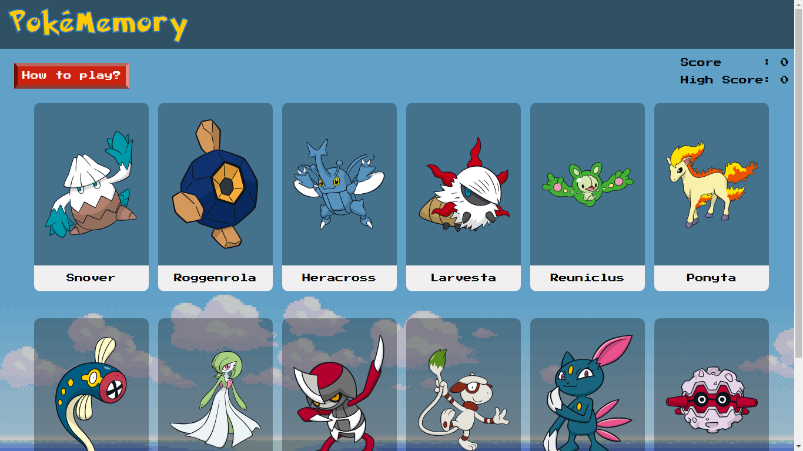

# PokeMemory Game

In PokeMemory game the player are tasked to select one unique Pokemon each round. The game ends when the player selects the same Pokemon twice.

## Demo

[Link to live demo](https://pokememory-theta.vercel.app/)

## Built With

- React

## Authors

- Github: [@fahryanputra](https://www.github.com/fahryanputra)
- Email: [fahryandi.herlasmara@gmail.com](fahryandi.herlasmara@gmail.com)

## Acknowledgements

- [Google Font](https://fonts.google.com/)
- [PokéAPI](https://pokeapi.co/)
